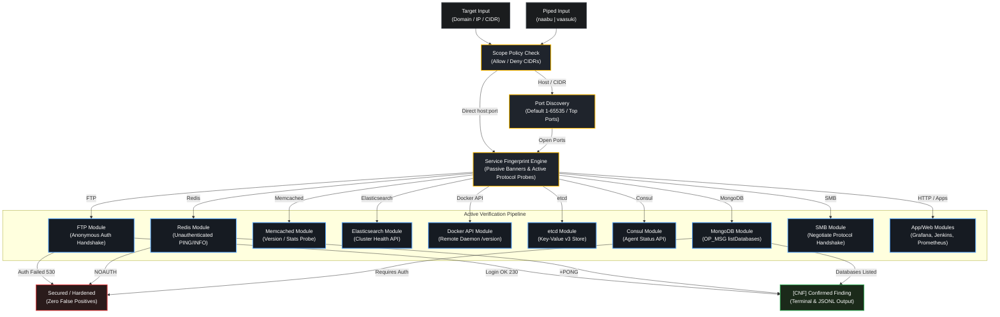

<p align="center">
  <h1 align="center">Vaasuki</h1>
  <p align="center">Network Service Reconnaissance & Active Verification Engine</p>
</p>

<p align="center">
  <a href="#overview">Overview</a> •
  <a href="#features">Features</a> •
  <a href="#architecture">Architecture</a> •
  <a href="#installation">Installation</a> •
  <a href="#usage">Usage</a> •
  <a href="#testing-lab">Testing Lab</a>
</p>

---

## Overview

Vaasuki is a high-performance network reconnaissance and service verification tool written in Go.

Most vulnerability scanners rely solely on passive banner grabbing, leading to high rates of false positives caused by backported patches and deceptive banners. Vaasuki eliminates false positives by dynamically fingerprinting exposed services and actively executing safe, non-destructive protocol handshakes (such as anonymous FTP logins, unauthenticated Redis commands, exposed Docker daemon APIs, and MongoDB administrative queries) to confirm actual exploitability before reporting findings.

## Features

* **Dynamic Service Fingerprinting:** Probes live open ports to detect underlying application protocols (FTP, Redis, Memcached, Elasticsearch, Docker API, etcd, Consul, Grafana, Jenkins, Prometheus, SMB, MongoDB) and falls back to port heuristics when inconclusive.
* **Active Verification:** Handshakes directly with target services to verify authentication states, eliminating banner-based false positives.
* **Integrated Port Discovery:** Embeds ProjectDiscovery's Naabu v2 runner to scan open ports automatically across all 65,535 ports by default, or focused top port sets (100, 1000, 10000).
* **Pipeline Integration:** Accepts piped input from tools like Naabu (`naabu -host target.com | vaasuki`), skipping duplicate port discovery and immediately executing service fingerprinting and active verification.
* **Strict Scope Validation:** Evaluates target hosts, IPs, and CIDRs against allow and deny policies to keep operations within authorized boundaries.
* **Three-Letter Status Output:** Clean console logging using colored three-letter status tags inside plain square brackets:
  * `[INF]` (Blue): Informational updates and operational progress
  * `[WRN]` (Yellow): Target warnings and non-fatal anomalies
  * `[ERR]` (Red): Connection errors and fatal drops
  * `[HIT]` (Magenta): Discovered exposures and potential weaknesses
  * `[CNF]` (Green): Confirmed findings and verified logins
* **Colorblind Friendly:** Built-in `-b` / `--color-blind` option to disable terminal ANSI sequences cleanly.
* **Structured Output:** Emits findings to JSONL for integration into Unix pipelines and reporting tools.

## Architecture



## Installation

```bash
go install -v github.com/R0X4R/vaasuki@latest
```

**Build from source:**

```bash
git clone https://github.com/R0X4R/vaasuki.git
cd vaasuki
go build -o vaasuki main.go
```

## Usage

```bash
vaasuki -h
```

### Flags Reference

| Short Flag | Long Flag | Default | Description |
| :--- | :--- | :--- | :--- |
| **`-u`** | `--target` | `""` | Single target host, IP, or CIDR block |
| **`-l`** | `--list` | `""` | Path to file containing target hosts |
| **`-p`** | `--ports` | `""` | Ports to scan (defaults to all `0-65535`, or e.g. `80,443`, `1-1000`) |
| **`-tp`** | `--top-ports`| `""` | Top ports profile for Naabu (`100`, `1000`, `10000`) |
| **`-vf`** | `--verify` | `true` | Perform safe active authentication verification |
| **`-sc`** | `--scope` | `""` | Path to scope authorization policy file |
| **`-t`** | `--threads` | `25` | Number of concurrent workers |
| **`-to`** | `--timeout` | `3` | Connection timeout in seconds |
| **`-r`** | `--rate` | `1000` | Maximum connection attempts per second |
| **`-o`** | `--output` | `""` | Output file path for findings |
| **`-j`** | `--json` | `false` | Write output in JSONL format |
| **`-s`** | `--silent` | `false` | Suppress banner and informational messages |
| **`-b`** | `--color-blind`| `false` | Disable terminal color codes |
| **`-v`** | `--verbose` | `false` | Show connection diagnostics |

### Examples

**Scan a target with default all-port discovery (0-65535):**

```bash
vaasuki -u 192.168.1.10
```

**Piping directly from Naabu output:**

```bash
naabu -host target.com | vaasuki
```

**Scan top 1000 ports and save confirmed findings to JSONL:**

```bash
vaasuki -u target.com -tp 1000 -o findings.jsonl
```

**Scan specific ports with custom rate limit:**

```bash
vaasuki -u 10.0.0.5 -p 21,2121,6379,9200,11211 -r 500 -o results.jsonl
```

## Testing Lab

Vaasuki includes a multi-container Docker Compose testbed under `lab/` that provisions both vulnerable and hardened instances of all supported services.

To start the lab:

```powershell
cd lab
docker compose up -d --build
```

To run Vaasuki against the local testbed:

```powershell
vaasuki -u 127.0.0.1 -p 2121,2122,6379,6380,9200,11211,2375,2379,8500,27017,27018
```
