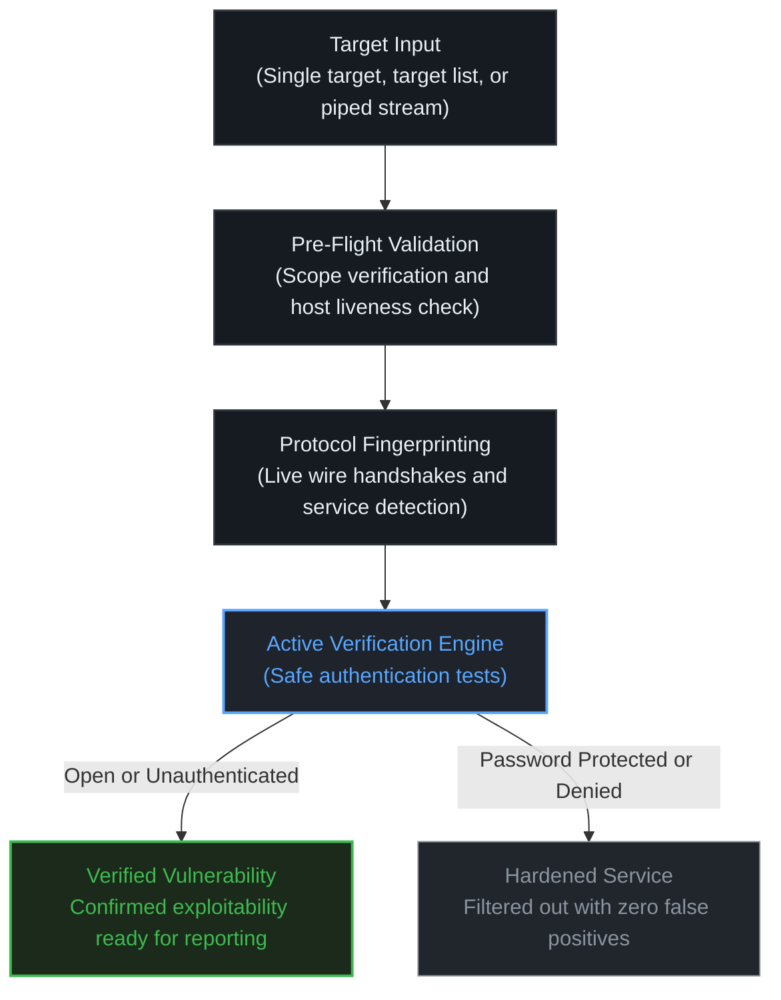

<p align="center">
  
  <p align="center">Hunt Vulnerabilities in Exposed Services</p>
</p>

<p align="center">
  <a href="#why-i-built-vaasuki">Why I Built Vaasuki</a> •
  <a href="#what-makes-it-different">What Makes It Different</a> •
  <a href="#verified-services">Verified Services</a> •
  <a href="#how-it-works">How It Works</a> •
  <a href="#installation">Installation</a> •
  <a href="#usage">Usage</a> •
  <a href="#testing-lab">Testing Lab</a> •
  <a href="#credits--acknowledgements">Credits</a>
</p>

## Why I Built Vaasuki

During my bug bounty hunting and security assessments, I noticed that almost everyone focuses heavily on web applications, while exposed infrastructure and non-HTTP network services receive very little attention.

I found myself constantly running tedious manual checks across exposed ports. I was manually trying anonymous logins on FTP servers, connecting to open Redis instances, checking if Docker daemons were exposing unauthenticated APIs, looking for unprotected Grafana dashboards, or querying anonymous LDAP binds.

These services are often the lowest-hanging fruit on an external perimeter, yet they frequently lead to critical, high-impact severity bugs like full database takeovers or remote code execution.

Most scanners out there either stop at basic port discovery or flood you with speculative banner-based false positives. I wanted a tool that would do the actual legwork for me and confirm whether a service is genuinely exploitable. That is why I created **Vaasuki**. My goal is simple. Turn overlooked, exposed services into verified bug bounty findings instead of just another list of open ports.

## What Makes It Different

* **Real Active Verification** - Instead of guessing based on version banners, Vaasuki actively completes safe, non-destructive protocol handshakes to prove whether authentication is truly missing.
* **Protocol-First Fingerprinting** - Even when services run on unusual or non-standard ports, Vaasuki speaks their native wire protocols to identify them dynamically.
* **Pipeline-Ready & Embedded Naabu Integration** - When scanning an IP or domain target where open ports are unknown, Vaasuki leverages embedded **Naabu** to perform fast SYN/connect port discovery. When piping from existing recon pipelines (`naabu -host target.com | vaasuki`), Vaasuki skips port scanning completely and begins active protocol verification immediately.
* **Fast Pre-Flight Host Discovery** - It quickly weeds out dead IPs or unresolvable domains before starting scans, saving you time. You can also pass `-Pn` to treat all targets as online.
* **Concurrent Worker Pool** - Built with worker goroutines to check thousands of ports and endpoints concurrently.
* **Strict Scope Boundaries** - Supports allow and deny CIDR lists with explicit exclusions so you stay strictly within your testing scope.
* **Clean Terminal and JSONL Output** - Delivers severity-categorized findings (`[CRITICAL]`, `[HIGH]`, `[MEDIUM]`, `[LOW]`, `[INFO]`) with service tags (`[SERVICE]`), target URLs, diagnostic tags (`[HIT]`, `[INF]`, `[WRN]`, `[ERR]`), and writes structured JSONL files for easy reporting.

## Verified Services

| Service | Common Ports | Verification Check | Confirmed Vulnerability Finding |
| --- | --- | --- | --- |
| **FTP** | `21`, `2121` | Active anonymous handshake | FTP Anonymous Authentication Enabled |
| **Redis** | `6379`, `6380` | Unauthenticated `PING` command | Unauthenticated Redis Database Access |
| **MongoDB** | `27017`, `27018` | OP_MSG wire protocol query | Unauthenticated MongoDB Administrative Database Access |
| **Docker API** | `2375`, `2376` | REST API probe via `/_ping` and `/version` | Exposed Docker Daemon API Without Authentication |
| **etcd** | `2379`, `2380` | Key-value store probe via `/version` | Unauthenticated etcd Key-Value Store Access |
| **Memcached** | `11211` | ASCII protocol `stats` and `version` execution | Unauthenticated Memcached Server Access |
| **Elasticsearch** | `9200`, `9300` | HTTP cluster health query | Unauthenticated Elasticsearch Cluster Access |
| **HashiCorp Consul** | `8500` | HTTP agent status probe | Unauthenticated HashiCorp Consul Agent API Access |
| **LDAP** | `389`, `3890` | BER-encoded LDAPv3 anonymous bind | LDAP Anonymous Directory Bind Authentication Permitted |
| **SMTP** | `25`, `1025` | Open mail relay handshake | SMTP Insecure Open Mail Relay Submission Allowed |
| **RabbitMQ** | `15672` | Management API check with default credentials | RabbitMQ Default Administrative Credentials |
| **SMB / Samba** | `445`, `4445` | Dialect negotiation handshake | Active SMBv1/SMBv2 File Sharing Service Detected |
| **DNS** | `53`, `5354` | CHAOS class `version.bind` query | Exposed DNS Nameserver Responding to CHAOS Version Queries |
| **Telnet** | `23`, `2323` | Cleartext negotiation and login prompt check | Exposed Insecure Telnet Cleartext Protocol Service |
| **Grafana** | `3000` | Anonymous organization check | Grafana Anonymous Access Enabled |
| **Jenkins** | `8080` | Unauthenticated dashboard probe | Exposed Jenkins CI/CD Instance |
| **Prometheus** | `9090` | Metrics and health query | Unauthenticated Prometheus Metrics API Exposed |


## How It Works




## Installation

```bash
go install -v github.com/R0X4R/vaasuki@latest
```

**Build from source**

```bash
git clone https://github.com/R0X4R/vaasuki.git && cd vaasuki && go build -o vaasuki main.go
```


## Usage

```bash
vaasuki -h
```

### Flags Reference

| Flag | Shorthand | Default | Description |
| --- | --- | --- | --- |
| `--target` | **`-u`** | `""` | Single target host, IP, or CIDR block |
| `--list` | **`-l`** | `""` | Path to file containing target hosts |
| `--ports` | **`-p`** | `""` | Ports to scan (defaults to all `0-65535`, or e.g. `80,443`, `1-1000`) |
| `--top-ports` | | `""` | Top ports profile for Naabu (`100`, `1000`, `10000`) |
| `--verify` | **`-vf`** | `true` | Perform safe active authentication verification |
| `--scope` | **`-sc`** | `""` | Path to scope authorization policy file |
| **`-Pn`** | | `false` | Treat all hosts as online and skip pre-flight host discovery |
| `--header` | **`-H`** | `""` | Custom HTTP headers to include in requests (e.g. `-H 'User-Agent: bot'`) |
| `--threads` | **`-t`** | `25` | Number of concurrent worker goroutines |
| `--timeout` | | `3` | Connection timeout in seconds |
| `--rate` | **`-r`** | `1000` | Maximum connection attempts per second |
| `--output` | **`-o`** | `""` | Output file path for findings |
| `--json` | **`-j`** | `false` | Write output in JSONL format |
| `--silent` | **`-s`** | `false` | Suppress banner and non-essential messages |
| `--color-blind` | **`-b`** | `false` | Disable terminal color codes |
| `--verbose` | **`-v`** | `false` | Show verbose connection diagnostics |
| `--version` | | `false` | Print tool version and exit |


### Examples

**Hunt vulnerabilities on an exposed target**

```bash
vaasuki -u target.com
```

**Piping directly from discovery tools into Vaasuki**

```bash
naabu -host target.com | vaasuki
```

**Verify vulnerabilities across top 1000 ports and save findings to JSONL**

```bash
vaasuki -u target.com -top-ports 1000 -j -o findings.jsonl
```

**Target specific ports with custom threads and rate**

```bash
vaasuki -u 10.0.0.5 -p 21,2121,2375,6379,9200,11211 -t 50 -r 2000 -o results.jsonl
```

**Treat all hosts as online (skip pre-flight host discovery)**

```bash
vaasuki -u 10.0.0.5 -Pn
```

**Include custom HTTP headers in requests**

```bash
vaasuki -u target.com -H "User-Agent: BugBountyBot/1.0" -H "X-Bug-Bounty: hacker1"
```

**Enforce strict scope policy with allow and deny rules**

```bash
vaasuki -l targets.txt -sc scope.txt
```

*Example `scope.txt`*

```text
# Allowed CIDRs and domains
10.0.0.0/8
*.example.com

# Explicit exclusions
!10.0.0.1
!internal.example.com
```

## Testing Lab

Vaasuki includes a multi-container Docker Compose testbed under `lab/` that provisions both vulnerable and hardened instances of all supported services.

To start the lab

```powershell
cd lab
docker compose up -d --build
```

To run Vaasuki against all lab endpoints

```powershell
vaasuki -u 127.0.0.1 -p 1025,2121,2122,2323,2375,2379,3000,3890,4445,5354,6379,6380,8080,8500,9090,9200,11211,15672,27017,27018
```

## Credits & Acknowledgements

Vaasuki stands on the shoulders of these open-source tools and libraries:

* **[ProjectDiscovery Naabu](https://github.com/projectdiscovery/naabu)** - High-speed, SYN/connect port discovery engine utilized when scanning raw hostnames or IP addresses to discover listening ports prior to verification.
* **[ProjectDiscovery goflags](https://github.com/projectdiscovery/goflags)** - Elegant and flexible CLI flag parsing framework powering Vaasuki's configuration, grouped options, and custom headers.
* **[Fatih Arslan's color (`fatih/color`)](https://github.com/fatih/color)** - Colorized terminal output and ANSI formatting for clear, high-contrast security reporting.

